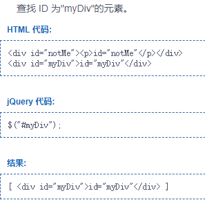
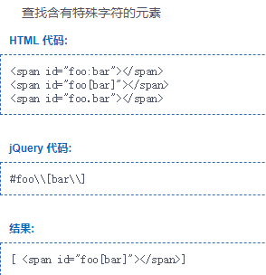
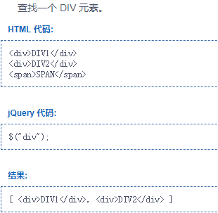
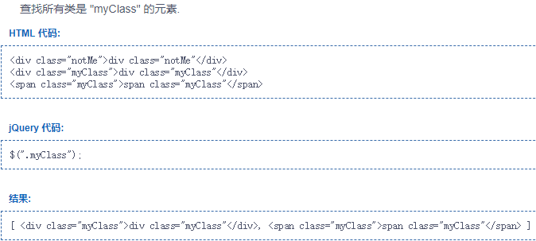

### js学习笔记

#### dom元素选择器

#### jQuery

##### 选择器

1. #元素id  

>根据给定的id匹配元素，==使用任何的字符作为名称的文本部分，他必须被两个反斜杠转义:`\\`==

2. 直接通过html元素的标签名匹配相关元素

3. `.css样式名称`

>根据给定的css类名匹配元素。==一个用以搜索的类。一个元素可以有多个类，只要有一个符合就能被匹配到。==

4. 获取所有元素

>匹配所有元素，多用于结合上下文来搜索

5. 根据多个元素

