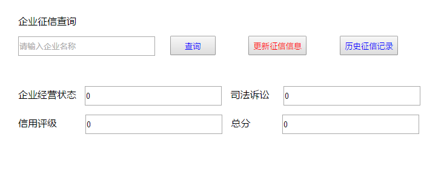

### Tomcat

----

 >文件目录 ：
 >
 >​	服务端：Tomcat
 >
 >​				MyWeb
 >
 >​					demo.html
 >
 >​					Aservlet.class
 >
 >​	 

用户通过浏览器访问tomcat，响应不同页面


#### HTTP协议

----

1. 协议约定规则

2. 网络协议

   >数据在网络上传输规则，eg：pop，http

3. Http协议

   >HTTP：Htyper text transform protocal
   >
   >超文本传输协议：如何在互联网上传输超文本
   >
   >HTML: 超文本标记语言Htyper text markup language

4. HTTP协议格式

   >由于我们平时访问互联网上的网页都是请求之后才响应，所以HTTP协议
   >
   >基于请求-响应模型，协议分为请求部分，响应部分

5. Http协议请求部分，响应部分

   >请求部分：请求行，请求头，请求体 
   >
   >`请求方式:`get/post(常用)，总共提供了七种方式
   >
   >响应部分：响应行，响应头，响应体

6. 

#### JavaSE的Socket编程 ---分析过程

----

>模拟浏览器向服务器端起HTTP请求，接受来自服务端响应回客户端的数据

* 图形分析(java socket )

* 创建一个socket，连接指定域名的80端口

* 获取输入输出流，==socket的输出流就是相当于服务器的输入流==

  服务器端 -- 客户端

  ```java
  Socket s = new Socket();
  serverSocket ss  = new serverSocket();
  //服务器输出流，socket获取服务器的accpet，然后将socket的输出流，进行输出
  ```

#### 动手实现tomcat(利用socket)

------

##### 实现tomcat版本一

----

* 案例需求

  1. 在webContent下发布静态资源Demo.html,demo01.html
  2. 启动tomcat服务器
  3. 当客户端对服务端发起不同的请求，localhost:8080/demo.html
  4. 服务器端可以将对应的html页面响应到客户端

  >服务器端需要进行的操作步骤
  >
  >1. 建立ServerSocket对象，监听本机的8080端口，等待来自客户端的请求
  >2. 获取到Socket对象
  >3. 通过Socket对象获取到输入流对象
  >4. 通过Socket对象获取到输出流对象
  >5. 通过输入流获取来自客户端的数据
  >6. 读取webContent下demo.html文件到服务器内存
  >7. 通过输出流将Http协议的响应行和响应头部分发送到客户端
  >8. 将内存中的demo.html内容作为响应体发送到客户端
  >9. 释放资源

* 代码实现

  ----

  ```java
  public class TomcatServer{
      //定义一个变量用来存放服务端WebContent目录的绝对路径
      public static String WEB_ROOT = System.getProperty("user.dir") + "\\" + "WebContent";
      private static String url = "";
      
      //实现启动服务器端的代码
      
      public static void main(String[] args) throws IOException {
          System.out.println(WEB_ROOT);
          ServerSocket serverSocket = null;
          Socket socket = null;
          InputStream is = null;
          OutputStream ops = null;
          try {
              serverSocket = new ServerSocket(8080);
              while (true) {//设定让所有的请求都进入到服务器端
                  //获取到客户端对应的Socket
                  socket = serverSocket.accept();
                  //获取到输入流
                  is = socket.getInputStream();
                  //获取到输出流
                  ops = socket.getOutputStream();
                  //获取HTTP协议的请求部分，截取客户端要访问的资源名称，将这个资源名称赋值给url
                  url = parse(is);
                  //发送一个静态资源
                  sendStaticResource(ops);
              }
          } catch (Exception e) {
              e.printStackTrace();
          } finally {
              if (is != null) {
                  is.close();
              }
              if (ops != null) {
                  ops.close();
              }
              if (socket != null) {
                  socket.close();
              }
              if (serverSocket != null) {
                  serverSocket.close();
              }
          }
      }
      
      /**
       * 获取HTTP协议的请求部分，截取客户端要访问的资源名称，将这个资源名称赋值给url
       *
       * @param is
       */
      private static String parse(InputStream is) throws IOException {
          //定义一个变量，存放HTTP协议请求部分数据
          StringBuffer sb = new StringBuffer(2048);
          //定义一个数组，存放HTTP协议请求部分数据
          byte[] buffer = new byte[2048];
          //定义一个变量i，代表读取数据到数组中之后，数据量的大小
          int i = is.read(buffer);
          //读取客户端发送过来的数据，将数据读取到字节数组buffer中，i代表读取数据量的大小
          //将客户端发送的数据存放在字符串中
          for (int j = 0; j < i; j++) {
              sb.append((char) buffer[j]);
          }
          //打印HTTP协议请求部分数据
          System.out.println(sb.toString());
          return parseUrl(sb.toString());
      }
      
      /**
       * 截取客户端要请求的资源路径demo.html，复制到url
       *
       * @param s
       * @return
       */
      private static String parseUrl(String s) {
          //定义两个变量，存放请求行的2个空格的位置
          int index, index1;
          //获取HTTP请求部分第1个空格的位置
          index = s.indexOf(" ", 0);
          //过去HTTP请求部分第2个空格的位置
          index1 = s.indexOf(" ", index + 1);
          //截取字符串获取到本次请求资源的名称--不需要有/
          String url = s.substring(index + 2, index1);
          //打印并返回本此请求静态资源名称
          System.out.println(url);
          return url;
      }
      
      
      /**
       * 发送一个静态资源
       *
       * @param ops
       */
      private static void sendStaticResource(OutputStream ops) throws IOException {
          //定义一个字节数组，用于存放本此请求的静态资源demo.html的内容
          byte[] bytes = new byte[2048];
          //创建一个文件输入流，用户获取静态资源demo.html的内容
          FileInputStream fis = null;
          try {
              //创建文件对象File，代表本次要请求的资源demo.html
              File file = new File(WEB_ROOT, url);
              //如果文件存在
              if (file.exists()) {
                  // 向客户端输出HTTP协议的响应行/响应头
                  ops.write("HTTP/1.1 200 OK \n".getBytes());
                  ops.write("Server:apache-Coyote/1.1\n".getBytes());
                  ops.write("Content-Type:text/html;charset=utf-8\n".getBytes());
                  ops.write("\n".getBytes());
                  // 获取到文件输入流对象
                  fis = new FileInputStream(file);
                  // 读取静态资源demo.html中的内容到数组中
                  int ch = fis.read(bytes);
                  while (ch != -1) {
                      // 将读取到数组中的内容通过输出流发送到客户端
                      ops.write(bytes, 0, ch);
                      ch = fis.read(bytes);
                  }
              } else {//如果文件不存在
                  // 向客户端响应文件不存在消息
                  ops.write("HTTP/1.1 404 not found \n".getBytes());
                  ops.write("Server:apache-Coyote/1.1\n".getBytes());
                  ops.write("Content-Type:text/html;charset=utf-8\n".getBytes());
                  ops.write("\n".getBytes());
                  String errorMessage = "file not found";
                  ops.write(errorMessage.getBytes());
              }
          } catch (Exception e) {
              e.printStackTrace();
          } finally {
              if (fis != null) {
                  fis.close();
              }
              
          }
      }
  }
  ```

  >==程序运行结果==

  ```java
  E:\jzyq_dev\WebContent
  GET /demo01.html HTTP/1.1
  Host: localhost:8080
  Connection: keep-alive
  Upgrade-Insecure-Requests: 1
  User-Agent: Mozilla/5.0 (Windows NT 10.0; Win64; x64) AppleWebKit/537.36 (KHTML, like Gecko) Chrome/56.0.2924.87 Safari/537.36
  Accept: text/html,application/xhtml+xml,application/xml;q=0.9,image/webp,*/*;q=0.8
  Accept-Encoding: gzip, deflate, sdch, br
  Accept-Language: zh-CN,zh;q=0.8
  Cookie: _ga=GA1.1.1025158543.1530582422; Idea-ccff6244=8e448dfd-ec86-41b2-9051-70f94ed68ad3
  
  
  demo01.html
  
  ```

  >==前台页面展示==

  ```html
  <!DOCTYPE html>
  <html lang="en">
  <head>
      <meta charset="UTF-8">
      <title>企业征信查询</title>
      <script src="https://code.jquery.com/jquery-3.1.1.min.js"></script>
  </head>
  
  <body>
  
  <form style="margin-top: 50px" action=" " method="post" id="credit_form" autofocus="autofocus" onsubmit="return false">
      <label style="width: 300px;height: 32px;text-align: right;margin-left: 300px;
      margin-top: 50px">企业征信查询&nbsp;&nbsp;</label></br>
      <input type="text" placeholder="请输入企业名称" id="key" name="key"
             style=" margin-left: 300px; margin-top: 15px;width:222px;height:26px;"/>
      <input type="hidden" value="3" id="keytype" name="keytype"/>
      <input type="submit" value="查询" id="submit_credit"
             style="color:blue;width:75px;height: 32px;margin-left: 20px"/>
      <button type=button style="margin-left: 50px; color:red;height: 32px;" onclick="updateInfo();">更新征信信息</button>
      <button type=button style="margin-left: 50px; color:blue;height: 32px;"
              onclick="skipToShow();">历史征信记录
      </button>
  
  </form>
  <div style="height: 32px;margin-left: 300px;margin-top: 50px">
      <label>企业经营状态&nbsp;&nbsp;</label>
      <input type="text" id="entstatus" value="0" readonly="readonly" style="width:222px;height:26px;">
      <label>&nbsp;&nbsp;司法诉讼&nbsp;&nbsp;&nbsp;&nbsp;</label>
      <input type="text" id="punished" readonly="readonly" style="width:222px;height:26px;" value="0">
  </div>
  <div style="height: 32px;margin-left: 300px;margin-top: 15px;">
      <label>信用评级&nbsp;&nbsp;&nbsp;&nbsp;&nbsp;&nbsp;&nbsp;&nbsp;&nbsp;</label>
      <input type="text" id="credit_rank" readonly="readonly" style="width:222px;height:26px;" value="0">
      <label>&nbsp;&nbsp;总分&nbsp;&nbsp;&nbsp;&nbsp;&nbsp;&nbsp;&nbsp;&nbsp;&nbsp;&nbsp;</label>
      <input type="text" id="total_grade" readonly="readonly" style="width:222px;height:26px;" value="0">
  </div>
  <div style="height: 32px;margin-left: 300px;margin-top: 15px;">
      <div style="display: none" id="status_div">
          <span style="color:red;">状态&nbsp;&nbsp;&nbsp;&nbsp;&nbsp;&nbsp;&nbsp;&nbsp;&nbsp;&nbsp;&nbsp;&nbsp;&nbsp;&nbsp;&nbsp;</span>
          <span class="status-span" style="color:red;">未通过</span>
      </div>
  </div>
  </body>
  </html>
  ```

  >==页面结果展示==

  

  

  

* 实现tomcat服务端解析HTTP请求部分

  ----

  >1. 读取Http协议请求部分数据
  >2. 解析请求行，获取本次请求的静态资源名称

  

##### 实现tomcat版本二

----

* 案例需求

  >服务端Tomcat
  >
  >1. 服务器自动读取配置数据到`map`
  >2. 获取``HTTP``请求部分
  >3. 解析本次请求路径``aa``
  >4. 从``map``获取``aa``对应的路径
  >5. 反射加载到内存创``AAServlet``对象
  >6. 向客户端发送``HTTP``协议响应头/响应行
  >7. 调用``AAServlet``对象的``init``，`service`方法
  >

* [TOC]

  代码实现

  >==新建一个interface --MyServlet==

  ```java
  /**
  所有interface中默认权限为public，因此可以忽略
  */
  public interface MyServlet {
      void init();
      void Service(InputStream is, OutputStream ops);
      void destroy();
  }
  ```

  >==建立AAServlet和BBServlet 类实现Servlet接口==

  ```java
  public class AAServlet implements MyServlet{
      @Override
      public void init() {
          System.out.println("aaServlet ... init");
      }
      
      @Override
      public void service(InputStream is, OutputStream ops) throws IOException {
          System.out.println("aaServlet .. service");
          ops.write("I am from AAServlet".getBytes());
          ops.flush();
      }
      
      @Override
      public void destroy() {
          System.out.println("aaServlet ... destroy");
      }
  }
  ```

  ```java
  public class BBServlet implements MyServlet{
      @Override
      public void init() {
          System.out.println("bbServlet ... init");
      }
      
      @Override
      public void service(InputStream is, OutputStream ops) throws IOException {
          System.out.println("bbServlet ... service");
          ops.write("I am from BBServlet".getBytes());
          ops.flush();
      }
      
      @Override
      public void destroy() {
          System.out.println("bbServlet ... destroy");
      }
  }
  
  ```

   >==配置文件(conf.peoperties)==

  ```properties
  # AAServlet的全路径
  aa =com.szkingdom.controller.AAServlet
  # BBServlet的全路径
  bb =com.szkingdom.controller.BBServlet
  ```

  >最终执行文件(TestServer)

  ```java
  package com.szkingdom.controller;
  
  import java.io.*;
  import java.lang.reflect.InvocationTargetException;
  import java.lang.reflect.Method;
  import java.net.ServerSocket;
  import java.net.Socket;
  import java.util.*;
  
  /**
   * @author Tongch
   * @version 1.0
   * @time 2018/10/23 15:42
   */
  public class TestServer {
      //定义一个变量用来存放服务端WebContent目录的绝对路径
      public static String WEB_ROOT = System.getProperty("user.dir") + "\\" + "WebContent";
      //定义静态变量，用于存放本次请求的静态页面名称
      private static String url = "";
      
      //定义一个静态类型MAP，存储服务端conf.properties中的配置信息
      private static Map<String, String> map = new HashMap<>();
      
      /**
       * 加载conf.properties中的参数
       */
      static{
          //服务器启动之前将配置参数中的信息加载到map中
          //创建一个properties对象
          Properties prop= new Properties();
          try {
              //加载WebContent目录下的conf.properties文件
              prop.load(new FileInputStream(WEB_ROOT+"\\conf.properties"));
              Set set = prop.keySet();
              Iterator iterator = set.iterator();
              //将配置文件中的数据读取到map中
              while(iterator.hasNext()){
                  String key = (String) iterator.next();
                  String value = prop.getProperty(key);
                  map.put(key,value);
              }
          } catch (IOException e) {
              e.printStackTrace();
          }
      
      }
      //实现启动服务器端的代码
      
      public static void main(String[] args) throws IOException {
          ServerSocket serverSocket = null;
          Socket socket = null;
          InputStream is = null;
          OutputStream ops = null;
          try {
              serverSocket = new ServerSocket(8080);
              while (true) {//设定让所有的请求都进入到服务器端
                  //获取到客户端对应的Socket
                  socket = serverSocket.accept();
                  //获取到输入流
                  is = socket.getInputStream();
                  //获取到输出流
                  ops = socket.getOutputStream();
                  //获取HTTP协议的请求部分，截取客户端要访问的资源名称，将这个资源名称赋值给url
                  url = parse(is);
                  
                  //判断本次请求的是静态demo.html还是运行在服务器端的一段java小程序
                  if (url != null) {
                      if(url.indexOf(".")!= -1){
                          //发送一个静态资源
                          sendStaticResource(ops);
                      }else{
                          //转到动态资源
                          sendDynamicResource(is,ops);
                      }
                  }
              }
          } catch (Exception e) {
              e.printStackTrace();
          } finally {
              if (is != null) {
                  is.close();
              }
              if (ops != null) {
                  ops.close();
              }
              if (socket != null) {
                  socket.close();
              }
              if (serverSocket != null) {
                  serverSocket.close();
              }
          }
      }
      /**
       * 动态资源转发
       * @param is
       * @param ops
       * @throws IOException
       * @throws ClassNotFoundException
       * @throws IllegalAccessException
       * @throws InstantiationException
       * @throws NoSuchMethodException
       */
  
      private static void sendDynamicResource(InputStream is, OutputStream ops) throws IOException, ClassNotFoundException, IllegalAccessException, InstantiationException, NoSuchMethodException {
          //将http协议的响应头/响应行发送到客户端，判断map中的key是否和本次带请求的资源路径一致
          ops.write("HTTP/1.1 200 OK \n".getBytes());
          ops.write("Server:apache-Coyote/1.1\n".getBytes());
          ops.write("Content-Type:text/html;charset=utf-8\n".getBytes());
          ops.write("\n".getBytes());
          //如果包含指定的key，获取到map中key对应的value
          if(map.containsKey(url)){
              String value =map.get(url);
              //通过反射将对应的java程序加载到内存
              Class<?> clazz= Class.forName(value);//全路径
              //新建一个程序实例
              MyServlet myServlet = (MyServlet) clazz.newInstance();
              //执行init方法，service方法
              //调用方法--此处方法因为是public，所以直接实例化后调用
              myServlet.init();
              myServlet.service(is,ops);
              //还可以通过下述方法调用，结果一样
              //Method init = clazz.getMethod("init", null);
              //init.invoke(clazz.newInstance());
          }
         
          
      }
      
      /**
       * 获取HTTP协议的请求部分，截取客户端要访问的资源名称，将这个资源名称赋值给url
       *
       * @param is
       */
      private static String parse(InputStream is) throws IOException {
          //定义一个变量，存放HTTP协议请求部分数据
          StringBuffer sb = new StringBuffer(2048);
          //定义一个数组，存放HTTP协议请求部分数据
          byte[] buffer = new byte[2048];
          //定义一个变量i，代表读取数据到数组中之后，数据量的大小
          int i = is.read(buffer);
          //读取客户端发送过来的数据，将数据读取到字节数组buffer中，i代表读取数据量的大小
          //将客户端发送的数据存放在字符串中
          for (int j = 0; j < i; j++) {
              sb.append((char) buffer[j]);
          }
          //打印HTTP协议请求部分数据
          System.out.println(sb.toString());
          return parseUrl(sb.toString());
      }
      
      /**
       * 截取客户端要请求的资源路径demo.html，复制到url
       *
       * @param s
       * @return
       */
      private static String parseUrl(String s) {
          //定义两个变量，存放请求行的2个空格的位置
          int index, index1;
          //获取HTTP请求部分第1个空格的位置
          index = s.indexOf(" ", 0);
          //过去HTTP请求部分第2个空格的位置
          index1 = s.indexOf(" ", index + 1);
          //截取字符串获取到本次请求资源的名称--不需要有/
          String url = s.substring(index + 2, index1);
          //打印并返回本此请求静态资源名称
          System.out.println(url);
          return url;
      }
      
      
      /**
       * 发送一个静态资源
       *
       * @param ops
       */
      private static void sendStaticResource(OutputStream ops) throws IOException {
          //定义一个字节数组，用于存放本此请求的静态资源demo.html的内容
          byte[] bytes = new byte[2048];
          //创建一个文件输入流，用户获取静态资源demo.html的内容
          FileInputStream fis = null;
          try {
              //创建文件对象File，代表本次要请求的资源demo.html
              File file = new File(WEB_ROOT, url);
              //如果文件存在
              if (file.exists()) {
                  // 向客户端输出HTTP协议的响应行/响应头
                  ops.write("HTTP/1.1 200 OK \n".getBytes());
                  ops.write("Server:apache-Coyote/1.1\n".getBytes());
                  ops.write("Content-Type:text/html;charset=utf-8\n".getBytes());
                  ops.write("\n".getBytes());
                  // 获取到文件输入流对象
                  fis = new FileInputStream(file);
                  // 读取静态资源demo.html中的内容到数组中
                  int ch = fis.read(bytes);
                  while (ch != -1) {
                      // 将读取到数组中的内容通过输出流发送到客户端
                      ops.write(bytes, 0, ch);
                      ch = fis.read(bytes);
                  }
              } else {//如果文件不存在
                  // 向客户端响应文件不存在消息
                  ops.write("HTTP/1.1 404 not found \n".getBytes());
                  ops.write("Server:apache-Coyote/1.1\n".getBytes());
                  ops.write("Content-Type:text/html;charset=utf-8\n".getBytes());
                  ops.write("\n".getBytes());
                  String errorMessage = "file not found";
                  ops.write(errorMessage.getBytes());
              }
          } catch (Exception e) {
              e.printStackTrace();
          } finally {
              if (fis != null) {
                  fis.close();
              }
          }
      }
  }
  
  ```

  >==程序运行结果==

  ```java
  E:\jzyq_dev\WebContent
  {aa=com.szkingdom.controller.AAServlet, bb=com.szkingdom.controller.BBServlet}
  GET /aa HTTP/1.1
  Host: localhost:8080
  Connection: keep-alive
  Cache-Control: max-age=0
  Upgrade-Insecure-Requests: 1
  User-Agent: Mozilla/5.0 (Windows NT 10.0; Win64; x64) AppleWebKit/537.36 (KHTML, like Gecko) Chrome/56.0.2924.87 Safari/537.36
  Accept: text/html,application/xhtml+xml,application/xml;q=0.9,image/webp,*/*;q=0.8
  Accept-Encoding: gzip, deflate, sdch, br
  Accept-Language: zh-CN,zh;q=0.8
  Cookie: _ga=GA1.1.1025158543.1530582422; Idea-ccff6244=8e448dfd-ec86-41b2-9051-70f94ed68ad3
  
  aa
  aaServlet ... init
  aaServlet .. service
  ```

  >==页面结果展示==

  

  

  

  