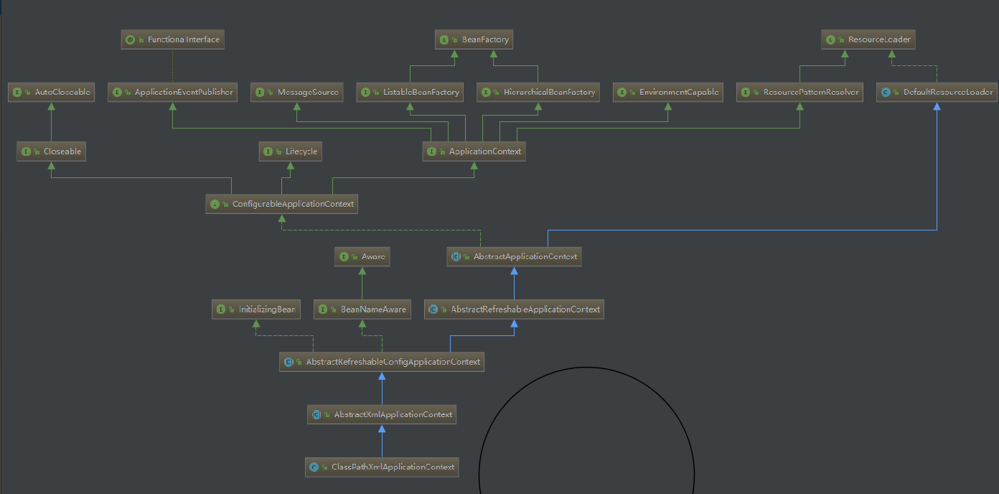

#### 深入了解`spring`源码

==为什么会用spring？？?==

**简化开发**

##### `spring`概念

1. 轻量级 ： 零配置编程，`api`使用简单
2. 面向bean ： 
3. 松耦合 ：充分利用`aop`思想
4. 万能胶 ：与主流框架无缝集成
5. 设计模式 ：`java`经典的设计模式都有体现

##### `spring`基础

1. ==控制反转== ：`spring`帮我们初始化类，无需自己实例化，相当与把控制权**反转**给`spring`
2. `IOC`: 类初始化后，`spring`会统一将初始化后的类放在一个`ioc`容器中
3. ==依赖注入==： 类在容器中时，通过**依赖注入**来取得容器中的`bean`对象。(`bean`中涉及多对象时，会按先后顺序实例化多个对象)

>这里的依赖指的是如果对象中涉及到其他对象，`spring`会自动为我们管理多对象之间的关系，以免初始化出错

4. `AOP`：面向切面编程。为了解耦

##### `spring`架构设计

* 常用的设计模式

>1. 动态代理 ：字节码重组时对象进行转换
>2. CGLib代理
>3. 工厂模式

* `spring`系统架构

>1. data Access 模块
>2. web 模块
>3. aop，Aspects，Messaging
>4. Core Container
>5. test 模块

* `spring` 核心容器有四个

>1. spring-beans
>2. spring-core
>3. spring-context
>4. spring-expression

* `spring mvc` 过程

>刚开始，``java``开发`web`应用分三种模式，分别是`j2ee`，`j2se`,`j2me`,分别代表着java web应用所对应的三个方向。
>
>发展历史：
>
>1. servlet，客户端请求servlet，通过xml配置bean和前端访问路径，调用doGet，doPost方法
>2. mvc模式（struts）。通过`controller`(即用户自己写的类)对url进行映射。无需反复修改xml
>3. spring mvc模式

##### `spring `源码解读

###### 怎么看源码？

>学会找入口，spring入口为`ClassPathXmlApplicationContext`,通过这个类不断去找其他类

###### `BeanFactory`

* 类图，其中`ClassPathXmlApplicationContext`为入口

* 其中`beanfactory`作为最顶层类，它定义了`IOC`容器的基本功能规范，有三个子类，`ListablebeanFactory`,`HierarchicalBeanFactory`和`AutowiredCapableBeanFactory`

###### IOC容器源码解析

1. 定位资源（定位查找配置文件）
2. 加载（已经找到配置文件）
3. 注册（已经记载好配置文件解析出来，并封装成BeanDefintion---里面保存着bean相关信息)

###### Bean源码解析

* 当容器中有Bean相关数据的时候，此时`ioc`容器还没有对管理的`bean`进行**依赖注入**

>依赖注入发生的条件
>
>1. 用户第一次通过`getBean()`方法向`ioc`容器索要`bean`时，`ioc`触发**依赖注入**
>2. 当用户在`bean`定义资源中为`<Bean>`元素配置了`lazy-init`属性，即让容器在注册`bean`定义时进行预实例化，触发**依赖注入**

* **`beanFactory`**接口定义了`spring,ioc`容器的基本规范，是`spring,ioc`所应遵守额最基本的编程规范。`beanfactory`接口定义了几个`getBean`方法，就是用户向`ioc`容器索取管理的`bean`的方法，我们可以通过分析其子类的具体实现，理解`spring,ioc`容器在用户索取`bean`时，如何完成**依赖注入**

###### ` FactoryBean`与`beanFactory`的区别

>+ `beanFactory`指的是`ioc`容器的编程抽象，比如`applicationContext,xmlbeanFactory`等，这些都是`ioc`容器的具体表现，需要使用什么样的容器由客户决定，但`spring`为我们提供了丰富的选择，
>+ `factoryBean`只是一个可以在`ioc`容器中被管理的一个`bean`，是对各种处理过程和资源的抽象，`factoryBean`在需要时产生另一个对象，而不返回`factoryBean`本身，我们可以把它看成是一个抽象工厂，对它的返回调用的是工厂生产的产品，所有的`factoryBean`都实现特殊的`org.springframework.beans.factory`接口，当使用容器中`factoryBean`的时候，该容器不会返回`factoryBean`本身，而是返回其生成的对象。
>+ `spring`包括了大部分的通用资源和服务访问抽象的`factoryBean`实现，其中包括：对`JNDI`查询的处理，对代理对象的处理，对事务性代理的处理等。这些我们都可以看成是具体的工厂，看成是`spring`为我们建立好的工厂，也就是说`spring`通过使用抽象工厂模式为我们准备了一系列工厂来生产一些特定的对象，免除我们手工重复的工作，我们要使用时，只需要在`ioc`容器中配置好就可以了

###### 依赖注入实现细节

###### `spring` 容器的高级特性

###### `spring` `aop`设计

* 拆分，合并，解耦
* 一个切面就代表着N个`bean`的一个集合
* 

