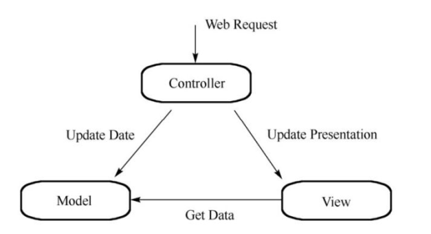

### 数据结构

> 1. 链表  
>
> 2. 数组
> 3. 二叉树
> 4. 树
> 5. 堆
> 6. 栈
> 7. 队列
> 8. 向量
> 9. Hash表

### Google的三个技术

>GTS 是一个可拓展的分布式文件系统，用于大型的，分布式的，对大量数据进行访问的应用
>
>MapReduce是针对分布式并行计算的一套编程模型，  
>
>BigTable 


不可变类（Immutable class）指当创建了这个类的先例后，就不允许修改它的值了，也就是说，一个对象一旦被创建出来，在其整个生命周期中，它的成员变量就不能被修改了。在java类库中，所有基本类型的包装类都是不可变类，例如Integer，Float等，此外，String也是不可变类

```java
Math类的方法：
static double ceil(double a) //返回小于等于a的最小整数
static double floor(double a)//返回小于等于a的最大整数
static double rint(double a)//四舍五入方法，返回与a的值最相近的整数，为double类型
static long round(double a)//四舍五入方法，返回与a的值最相近的长整型数
static int round(float a)//四舍五入方法，返回与a的值最相近的整型数
```

### java运算符

>`<<` 逻辑左移 ：将原来的数字在右方添0 eg：2 `<<` 1    
>
>​	10 --->100(二进制)

### Java接口

>接口和抽象类是支持抽象类定义的两种机制，
>
>1. 区别
>   * 接口中只有定义，不能有方法的实现，而抽象类可以有实现与定义，即其方法可以在抽象类中被实现
>   * 实现接口用implements，继承抽象类的关键字为extends，类可以实现多个接口，但只能继承一个抽象类
>   * 接口强调特定的功能的实现，抽象类强调所属关系
>   * 接口运用于比较常用的功能，便于日后维护或者添加删除方法，抽象类更倾向于充当公共类的角色，不适合日后重新对里面的代码进行修改
>
>接口：公开，里面不能有私有的方法或变量，是用于让别人使用额度
>
>抽象类：可以有私有方法或私有变量，如果一个类中包含抽象方法，那么这个类就是抽象类，抽象类需要有`abstract`关键字、
>
>2. 相同点
>   * 接口都不能被实例化
>   * 接口的实现类或抽象类的子类只有实现了接口或者抽象类的方法才能被实例化

### 观察者模式

### 一个完整应用

> 包括：数据与页面之间的绑定，网络请求，路由的分发，数据库的增删改查。 

### 前端

==js：面向对象的编程，也是函数式编程==

>前端文件==.js== 和 ==.min.js==的区别
>
>* 压缩处理的文件min.js，一般网站正常运行时使用压缩后的文件，节约网站传输量
>* 在开发调试过程中，一般使用原始的，未经压缩的文件.js，以便进行调试跟踪

#### js中函数声明和函数表达式的区别

```javascript
//函数声明
function fun(a,b){
	return a+b;
}
//函数表达式
var sum = function fun(a,b){
    return a+b;
}
```

>* ==函数声明==在js解析时进行函数提升，因此在同一个作用域内，不管函数声明在哪里定义，该函数都可以调用，
>* ==函数表达式==的值是在js运行时确定，并且在==表达式赋值完成== 后，该函数才能调用
>* ==函数表达式==的名称是可选的
>* ==函数表达式==后面可以跟圆括号，而==函数声明==后面不能跟圆括号

在`js`中，要明白一点：==函数就是对象==

>==自动执行函数（立即调用的函数表达式）==
>
>函数表达式后面跟圆括号，以实现立即调用执行的效果，

#### 回调函数

* 一个通过指针调用的函数，如果你把函数的指针（地址）作为参数传递给另一个函数，当这个指针被用来调用其所指向的函数时，我们就说这是回调函数
* 传统函数以参数形式输入数据，并且使用返回数据返回值，理论上，在函数结尾处有一个return返回语句，结构上就是：一个输入点，一个输出点。==函数本质上就是输入和输出之间实现过程的映射==
* 当函数的实现过程非常漫长的时候，你是等待函数完成处理，还是使用回调函数进行异步处理呢？这种情况下，使用回调函数变得非常重要，eg:AJAX请求，如果使用回调函数进行处理，代码就可以继续进行其他任务，无需等待

#### 函数声明转换成函数表达式方法：

```javascript
function (){
    /*函数声明
    */
}  ==> (function(){/* 函数表达式*/}()); 等价于 (function(){/*code 推荐使用* /})();
//函数的调用需要在变量中加（），因此在创建函数时，直接给函数添加（），即起到立刻调用执行函数的效果
```

==javascript会在代码行结束后自行添加==

```javascript
eg：return "hello"；
return                                  return ;
	"hello";  -->   编译后：                 "hello";
```

`js`的特色：单线程和事件轮询

#### html中数据加载顺序

>浏览器会按照<script>标签在html页面出现的先后顺序，依次进行解析
>
>按照惯例，所有的<script>标签都应该放在<head>元素中，但是这意味着必须等到全部JavaScript代码都被下载，解析和执行完成后，才能呈现页面的内容。**因为浏览器只有在遇到<body>标签时才会呈现内容**。因此对于引用很多js的页面时，浏览器加载时会出现明显的延迟，而延时期间的窗口将是一片空白。为了避免这个情况，现代web应用一般都是把全部JavaScript引用放在<body>标签中，而且是放在页面内容的后面

#### Json数据格式的优点（JavaScript Object Notation）

>* Json数据格式比较简单，基本没什么浪费的字节，易于读写
>* Json格式能够直接为服务器端代码使用，大大简化了客户端与服务器端的代码量，易于维护
>* Json与编程语言无关，任何编程语言都可以轻松使用Json
>* Json类型安全，值是有类型的，如字符串，整数，布尔型等

#### Node.js

* 概念：**核心理念是事件驱动编程**（对于程序员来说，必须事先知道有那些事件，以及如何响应这些事件）

  ```flow
  st=>start: 点击按钮（客户端触发）
  op1=>operation: 产生单击事件（后台响应）
  st->op1
  ```

* Node.js工程配置文件 package.json 

  >npm install 命令根据这个配置文件，自动下载所依赖的模块，配置项目所需要的运行环境。
  >
  >模块版本号：1.2.2 ：大版本.次要版本.小版本
  >
  >~ + 指定版本(~1.2.2),表示要安装1.2.x的最新版本，不得低于1.2.2，但是不安装1.3.x，也就是说，安装时不改变大版本号和次要版本号

* Node.js工程服务入口文件app.js或server.js

#### Express

* 概念：路由，中间件，模板引擎

* Express的路由

  >对于任何一个应用服务器来说，其核心在于它是否有一个强劲的路由（route），试想一下网络的请求的过程：客户端发送请求，服务器找到资源，并返回给客户端

* Express的中间件

  >中间件时对处理HTTP请求功能的一中封装，具体的表现形式为中间件是一个函数，他有三个参数：
  >
  >1. 网络请求对象
  >2. 服务器响应对象
  >3. next回调函数（表示下一个中间件）
  >
  >中间件是在管道中执行的，打个形象的比喻，这好比一个送水的管道，水从一端灌入，在输送到目的地之前，还会经过各种仪表和阀门。从Express4.0起，中间件和路由处理器都是按照它们的连入顺序调用的。这样一来，顺序变得更加清晰自然。在管道的最后，通常放一个“捕获一切”请求的处理器，由他来处理很前面都不匹配的路由请求

  **session和cookies**

  >session含义：web用户看来,从打开一个浏览器访问一个电子商务网站开始，到登陆，完成购物和支付，直到关闭浏览器这就是一个会话。
  >
  >对web开发者，用户登陆时需要临时存储用户的登陆信息，这个存储结构就是会话

  **网络请求方法**（需要加载json解析中间件）

  1. 对于path中的变量，均可以使用req.params.xxx方法。
  2. 对于Get请求的？xxxx= ，使用req.query.xxxx方法
  3. 对于Post请求中的变量，使用req.body.xxxx方法

  ==对于web来说，针对资源的操作通过Http方法来体现。==

  #### 模板引擎（要求：用户体验为王，希望模板引擎尽可能快）

  * 服务器端
  * 客户端

  #### AngularJs

  >MVC模式

  

  

  

  

  

  