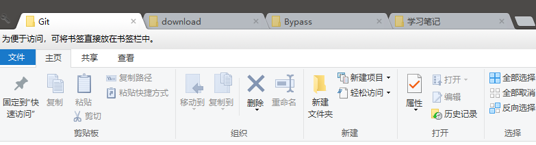
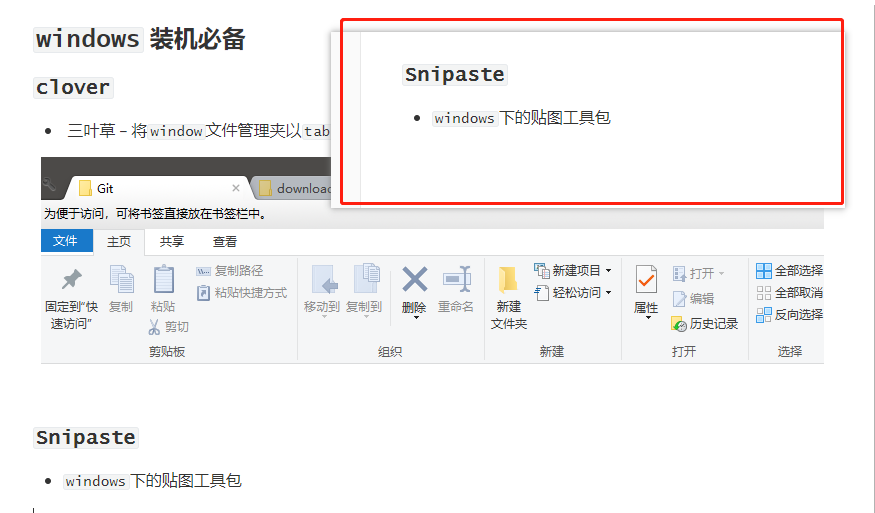
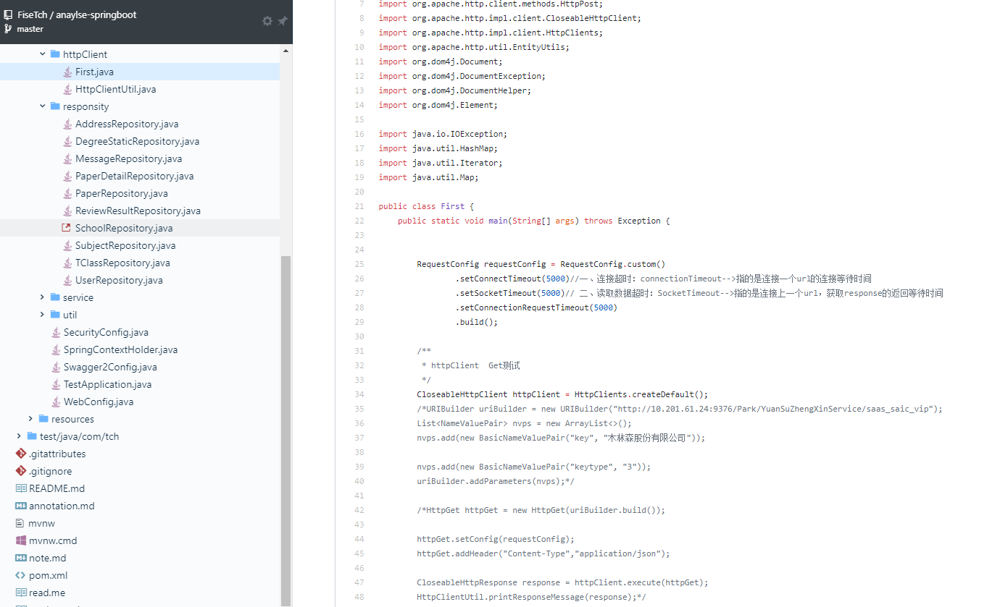

### `windows` 装机必备

####　`clover` 

*  三叶草 -- 将`window`文件管理夹以`tab`页签的形式展示

####  `Snipaste`

* `windows`下的贴图工具包

#### `PanDowload`

* 破解百度云限速工具

#### `PotPlayer 64`

* 比较全面的视频播放器

#### `Xshell`

* 远程连接到`linux`服务端的远端连接工具

#### `Xftp`

* 效率超高的远程传输文件工具

#### `Typora`

* `markdown`文件编辑器

#### `notepad++`

* 好用的文本编辑器--支持插件

#### 向日葵

* 远程控制访问工具，主要是`TeamViewer`会限制访问时间，检测到商业用途

#### `idea` 插件

##### `Translation`

* `idea`自带的翻译插件，超级好用

#####  `Rainbow Brackets`

* 用来对代码的多重括号进行分色渲染与展示，便于开发

#### `chrome` 插件

##### `Octotree`

* `github`浏览神器  --  用来将`github`项目目录格式化查看

##### `Clear Cache`

* 用来清理页面缓存的工具，比较轻巧方便，点击一下就可刷新缓存

##### `Tampermonkey`

* 好用的脚本插件工具--支持自定义脚本

##### 谷歌访问助手

* 不翻墙的同学可能会存在进入不了`google`应用商店的情况，先去百度搜索一下谷歌访问助手（一般是360），然后就可以下载插件了

### 比较常用的网站

#### `processon`

* 在线画流程图，思维导图

