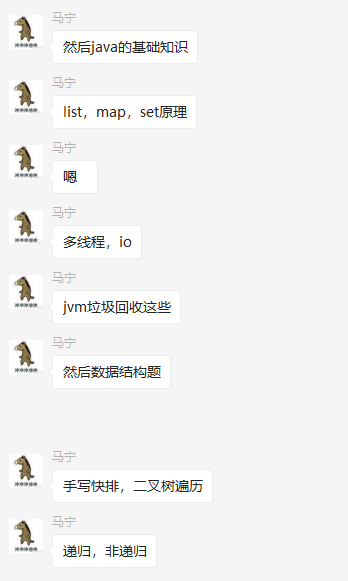

### `prepare-1`

#### `经验`

* 

#### `java`多线程相关

##### 线程池的原理，为什么要创建线程池？创建线程池的方式

* 在线程池之前，我们每次使用线程都是自己新建一个，用完后直接销毁，如果ping'fan线程

* 线程池的四个状态
  1. `RUNNING`线程池处于运行状态
  2. `SHUTDOWN`线程池处于关闭状态，此时不能接受新任务，单已启动的任务需要等运行结束后在停止
  3. `SHUTDOWNNOW`线程池立刻关闭，不仅不能接受新任务，并且还会尝试关闭正在执行的任务
  4. `TERMINATED`当线程池处于`SHUTDOWN`或者`STOP`状态，并且所有工作线程已被销毁，任务缓存队列已经清空或者执行结束

##### 线程的声明周期，什么时候会出现僵死进程

##### 说说线程的安全问题，什么实现线程安全，如何实现线程安全

##### 创建线程池有哪几个核心参数？如何合理配置线程池的大小

##### `volatile`,`ThreadLocal`的使用场景和原理

##### `ThreadLocal`什么时候会出现`oom`的情况？为什么？

##### `synchronized`,`volatile`区别，`synchronized`锁粒度，模拟死锁场景，原子性与可见性

#### `jvm`相关

##### `jvm`	内存模型，`GC`机制和原理

##### `GC`分为哪两种,`Minor GC`和`Full GC`有什么区别？什么时候会触发`Full GC`?分别采用什么算法？

##### `Jvm`里的有几种`ClassLoader`，为什么会有多种？

##### 什么是双亲委派机制？介绍一些运作过程，双亲委派模型的好处

##### 什么情况下我们需要破坏双亲委派模型

##### 常见的`jvm`调优方法有那些？可以具体到调整哪个参数，调成什么值？

##### `jvm`虚拟机内存划分，类加载器，垃圾收集算法，垃圾收集器，`class`文件结构是如何解析的

#### `redis`

##### `redis`为什么这么快？`redis`采用多线程会有那些问题？

##### `redis`支持哪几种数据结构

##### `redis`跳跃表的问题

##### `redis`单进程单线程的`redis`如何能够高并发

##### `redis`如何使用`redis`实现分布式锁？

##### `redis`分布式锁操作的原子性，`redis`内部是如何实现的？

#### `java`高级部分

##### 红黑树的实现原理和应用场景

##### `NIO`是什么？适用于何种场景？

##### `java 9`比`java 8`改进了什么？

##### `Hashmap`的内部数据结构是什么？底层是怎么实现的？**`concurrentHashMap`**,`HashTable`

##### 说说反射的用途及实现，反射是不是很慢，我们在项目中是否要避免适用反射

##### 说说自定义注解的场景和实现

##### `List`和`Map`区别，`ArrayList`与`LinkedList`的区别，`ArrayList`与`Vector`区别

#### `Spring`相关

#####  `Spring Aop`的实现原理和场景？

##### `Spring bean`的作用域和生命周期

##### `Spring Boot`比`Spring`做了那些改进？`Spring 5`比`Spring 4`做了那些改进？

##### 如何自定义一个`Spring Boot Starter`

##### `Spring IOC`是什么？优点是什么?

##### `SpringMvc`，动态代理，反射，`aop`原理，事务隔离级别

#### 中间件篇

##### `Dubbo`完整的一次调用链路介绍

##### `Dubbo`支持几种负载均衡策略

##### `Dubbo Provider`服务提供者要控制执行并发请求上限，具体怎么做？

##### `Dubbo`启动的时候支持几种配置方式

##### 了解几种消息中间件产品？各产品的优缺点介绍

##### 消息中间件如何保证消息的一致性和如何进行消息的重试机制？

##### `Spring Cloud`熔断机制介绍

##### `Spring Cloud`对比下`Dubbo`，什么场景下该使用`Spring Cloud`?

#### 数据库

##### 锁机制介绍：行锁，表锁，排他锁，共享锁

##### 乐观锁的业务场景及实现方式

##### 乐观锁的业务场景及实现方式

##### 事务介绍，分布式事务的理解，常见的解决方案有那些，什么是两阶段提交，三阶段提交

##### `Mysql`记录`binlog`的方式主要包括三种模式？每种模式的优缺点是什么？

##### `Mysql`锁，悲观锁，乐观锁，排他锁，共享锁，表级锁，行级锁

##### 分布式事务的原理2阶段提交，同步、异步，阻塞，非阻塞

##### 数据库事务隔离级别，`Mysql`默认的隔离级别，`Spring`如何实现事务，`JDBC`如何实现事务，嵌套事务实现，分布式事务实现

##### `sql`的整个解析，执行过程原理，`sql`行转列

#### `token`的前后端实现

#### 声明式事务的失效机制

#### 自定义线程池的内部实现

